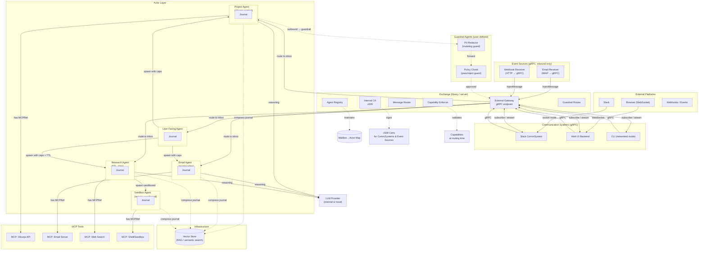

# Agentic Systems

An architecture for multi-user, multi-agent coordination built on an actor model.

## Glossary

* **Actor** — A unit of computation with a mailbox that processes messages sequentially, can spawn child actors, and
carries a security context. Every agent is an actor, but not all actors are agents.
* **Agent** — An actor that uses an LLM for reasoning. Agents wrap MCP tools with contextual instructions, maintain a
private journal, communicate via mailboxes, and carry a security context. An agent may have a guardrail assigned at
spawn time for outbound message interposition.
* **Capability** — A reference that confers authority: a mailbox address (can message that actor), an MCP server handle
(can call those tools), or a spawn token (can create children). Possession IS authorization in the actor model.
* **Child Agent** — An agent spawned by another agent with specific context, capability set, optional TTL, optional
guardrail mailbox, and a (possibly reduced) security context.
* **CLI** — A synchronous, stdin/stdout Communication System supporting both embedded (in-process Exchange) and
networked (gRPC-connected) modes.
* **Communication Channel** — A mechanism for transporting messages between agents and users on a specific
communication system.
* **Communication System** — A bidirectional gRPC bridge between an external platform (Slack, Web UI, CLI, etc.) and
the Exchange. Handles protocol translation, authentication, and subscription streams for agent output.
* **Event Source** — An inbound-only adapter that receives external events (webhooks, email, sensors) and injects them
into an agent's mailbox via a gRPC `InjectMessage` call. Authenticated via x509. One-directional — no subscription
stream back to the source. The Exchange stamps provenance information on each message so the target agent can apply
appropriate trust processing.
* **Exchange** — A library (importable, embeddable) and standalone server providing message routing between actor
mailboxes. Maintains an agent registry and routing table, enforces capabilities at delivery, routes outbound messages
through guardrails, federates across machines, and propagates OpenTelemetry trace context.
* **Guardrail Agent** — A user-managed agent placed in another agent's outbound message path for interposition.
Receives outbound responses before delivery and decides whether to pass, reject, or mutate. May be placed between any
two actors (agent → guardrail → agent, agent → guardrail → CommSystem, etc.). Exists in two flavors: Pass/Reject Guard
and Mutating Guard. Guardrail agents hold zero MCPRefs by design.
* **Journal** — Every actor's append-only record of all activity: received messages (including origin mailbox), sent
messages, tool invocations and results, and internal state transitions. Short-term entries stay in the LLM context
window; long-term entries are compressed and indexed for retrieval.
* **Mailbox / Inbox** — A message queue belonging to an actor. Messages are processed sequentially by the owning actor.
The mailbox address IS the capability to send messages to that actor.
* **MCP (Model Context Protocol)** — A protocol for connecting agents to external tools and data sources.
* **Mutating Guard** — A guardrail agent that evaluates outbound messages and responds with `{decision: "approve",
modified_content: "..."}`. The Exchange forwards the modified version instead of the original. Used for redaction,
sanitization, or formatting.
* **Pass/Reject Guard** — A guardrail agent that evaluates outbound messages and responds with either `{decision:
"approve"}` or `{decision: "reject", reason: "..."}`. The Exchange forwards or blocks the message accordingly.
* **Provenance** — A trust-level tag stamped on every message by the Exchange indicating its origin. Examples:
`event_source:inbound-email`, `comm_system:slack/user:U1234`, `internal_agent:research-agent`.
* **Security Context** — Identity, tenant, and capability set attached to an actor. Controls which actors may address
it (target-side ACL) and what system-level actions it may perform.
* **Tool** — An MCP-exposed capability. Tools are scoped to individual agents, which add contextual instructions
specific to their domain (e.g., "this Vikunja bucket is for work projects").
* **User** — A real person interacting with the system.

## Architecture

### System Diagram



### Actor Model

The system uses an actor model where every agent is an actor with a private mailbox. Messages are the sole
communication primitive between actors, providing:

- **Isolation**: No shared state between actors. If an agent needs information from another, it sends a message and
receives a response.
- **Location transparency**: Actors may live on any machine.
- **Supervision hierarchies**: Parent actors spawn and monitor children.
- **Backpressure**: Mailboxes inherently buffer and order messages.

```
                    Exchange
    ┌──────────────────────────────────────────┐
    │  ┌────────┐  ┌────────┐  ┌────────┐     │
    │  │Inbox A │  │Inbox B │  │Inbox C │     │
    │  └───┬────┘  └───┬────┘  └───┬────┘     │
    │  ┌───▼────┐ ┌───▼────┐ ┌───▼────┐       │
    │  │Actor A │ │Actor B │ │Actor C │       │
    │  └────────┘ └────────┘ └────────┘       │
    └──────────────────────────────────────────┘
```

### Agent Structure

Each agent contains:

1. **Mailbox** — Incoming message queue (address = capability to send)
2. **Journal** — Append-only record of all activity: received messages (with origin mailbox), sent messages, tool
invocations and results, internal state transitions. Short-term entries are in the LLM context window; long-term
entries are compressed and indexed for retrieval.
3. **Inference Platform** — LLM integration for reasoning
4. **Capability Set** — Held references: mailbox addresses of known actors, MCP server handles, spawn tokens
5. **Target-side ACL** — Optional allow/deny list for incoming senders
6. **Guardrail Mailbox** — Optional mailbox address of a guardrail agent through which all outbound messages are routed
7. **Child Registry** — References to spawned child actors

### Communication Flow

```
Event Source → gRPC InjectMessage → Exchange → Agent Mailbox → Agent

User → CommSystem → gRPC SendMessage → Exchange → Agent Mailbox → Agent
                                                                      ├── Spawn Child Agent (granting subset of capabilities)
                                                                      ├── Call MCP Tool (via held MCPRef capability)
                                                                      ├── Compress journal to vector store (when context threshold exceeded)
                                                                      └── Respond → Guardrail Agent(s) → Exchange → destination

Destinations for outbound responses:
  → CommSystem subscription stream → User
  → Another agent's mailbox (agent-to-agent)

Guardrails are user-defined agents placed in the outbound path.
Multiple guardrails chain: PII Redactor → Policy Check → destination.
The Exchange routes through each guardrail in order before final delivery.
```

### Exchange

The Exchange is both a **library** (importable, embeddable) and a **standalone server**. Its responsibilities:

- **Registry**: Maps actor identities to mailbox locations
- **Routing**: Delivers messages to the correct destination mailbox
- **Capability Enforcement**: Validates sender has a reference to the target mailbox before delivery; forwards to
target-side ACL for secondary check
- **Guardrail Routing**: Routes outbound messages through designated guardrail agents in sequence before delivery
- **External Gateway**: Accepts gRPC connections from Communication Systems and Event Sources; manages subscription
streams for outbound delivery to CommSystems
- **Internal CA**: Issues x509 certificates to authenticated CommSystems, Event Sources, and agents
- **Federation**: Routes across machines when exchanges are networked
- **Observability**: Propagates OpenTelemetry trace context with every message

An Exchange may run embedded (in-process, no persistence) or as a server (with optional persistence for routing table
and agent state).

### Exchange External Gateway

The Exchange exposes a single external protocol: **gRPC**. All Communication Systems and Event Sources connect via gRPC
to the external gateway.

**Communication Systems (bidirectional):**

- **Inbound**: CommSystem calls `SendMessage(agent_id, envelope)` → Exchange validates the CommSystem has a capability
reference to the target agent's mailbox → routes to agent's inbox.
- **Outbound**: On connect, CommSystem establishes a `Subscribe(agent_ids[])` streaming RPC. Exchange pushes agent
responses, status changes, and events into the stream. CommSystem translates stream events into platform-specific
output (Slack thread reply, CLI stdout, browser push).

**Event Sources (inbound only):**

- **Inbound**: Event source calls `InjectMessage(agent_id, envelope)` → Exchange validates the Event Source's x509
identity, stamps provenance on the message, and routes it to the target agent's inbox.
- **No outbound**: Event sources have no subscription stream. They inject events and receive no response back through
the same connection.

**Auth on connect**: CommSystems and Event Sources present x509 certificates (or Unix peer cred for local sockets).
Exchange validates against the CA. Platform-specific CommSystems (Slack) additionally map the platform user identity to
a security principal.

**Protocol choice**: gRPC only for Exchange-facing communication. WebSocket is used exclusively between browser and Web
UI backend (which itself is a CommSystem speaking gRPC to the Exchange). This keeps the Exchange's external contract
typed (protobuf) and minimal.

### Event Sources & Inbound Adapters

Event Sources are one-directional adapters that bridge external systems into the actor model. They receive events from
outside and inject them as messages into an agent's mailbox.

**Characteristics:**

- **One-directional**: Events flow in; no response stream back to the source
- **Authenticated via x509**: Same certificate model as CommSystems — CSR flow, internal CA, admin approval
- **Provenance tagging**: The Exchange stamps `message.provenance` with the source identity (e.g.,
`event_source:inbound-email`, `event_source:github-webhook`). The target agent uses this tag to determine trust level
and apply appropriate processing rules.
- **gRPC**: Single RPC — `InjectMessage(agent_id, envelope)` — no `Subscribe`, no stream

**Examples:**

- **Email Receiver**: Connects via IMAP, fetches new messages, injects each into an agent's mailbox for processing
- **Webhook Receiver**: HTTP endpoint that validates HMAC signatures, calls `InjectMessage` with the parsed event
- **RSS/Feed Poller**: Periodically fetches feeds, injects new items as messages
- **Sensors**: IoT or system monitors that push events on state changes

**Zero-Tool Agent Pattern:**

Unprocessed event source input (email, webhooks) is potentially untrusted. The recommended processing pattern:

```
Event Source → Summarization Agent (zero MCPRefs) → User/Trusted Agent
```

The summarization agent:
- Holds **zero MCPRefs** — cannot call any tool, cannot send to sensitive actors
- Holds only the mailbox address of a user-facing agent or trusted processor
- Reads the incoming event, produces a summary, and forwards it
- If action is needed, the user or a trusted agent initiates it separately through a different path

This physically constrains blast radius. Even a fully compromised summarization agent has no capabilities to exfiltrate
data, call APIs, or interact with sensitive systems.

### Guardrails

Guardrails are user-defined agents placed in the outbound message path of another agent. They implement
**interposition** — every response an agent sends passes through its guardrail before reaching the destination. This is
a general mechanism: guardrails can sit between any two actors, including agent → another agent and agent → CommSystem.

**Configuration:**

When spawning an agent, the parent may designate a `guardrail_mailbox`. All outbound messages from that agent are
routed through the guardrail before delivery. The Exchange performs the routing automatically.

**Routing flow:**

```
Agent → Outbound Response → Exchange → Guardrail Agent → Exchange → Destination
                                             │
                                    approve ─┤
                                             │
                                    reject ──┴──→ Dead letter / notification
```

**Two types:**

- **Pass/Reject Guard**: Evaluates the message and responds with `{decision: "approve"}` or `{decision: "reject",
reason: "..."}`. The Exchange forwards or blocks the message accordingly. If rejected, the Exchange may notify the
origin agent or discard silently based on configuration.

- **Mutating Guard**: Evaluates the message and responds with `{decision: "approve", modified_content: "..."}`. The
Exchange forwards the modified version. Used for redaction (PII stripping), sanitization (removing markup), or
formatting (rewriting for a specific output channel).

**Composability:**

Guardrails chain naturally. The spawner specifies a sequence:

```
Agent → PII Redactor (mutate) → Policy Check (pass/reject) → Destination
```

The Exchange routes through each guardrail in order. If any guardrail rejects, the chain stops.

**Design constraints:**

- Guardrail agents hold **zero MCPRefs** by design. They cannot call tools, cannot cause side effects, cannot
exfiltrate. Their only function is to inspect and respond to messages.
- Guardrails are **not built into the Exchange**. The Exchange provides the routing pattern; users define guardrails as
ordinary agents with whatever logic their use case requires (keyword filtering, PII detection, content policy, manual
approval workflows).
- Guardrails themselves may have guardrails (recursive composition), though this adds latency.

**Capabilities Model**

The system uses an **object-capability (ocap) model**. A capability is a reference that confers authority. Possession
of the reference IS authorization — there is no ambient authority or global ACL.

**Primitive capabilities:**

| Capability | What it grants | Granted by |
|------------|---------------|------------|
| `MailboxRef(id)` | Send messages to the target actor's mailbox | Parent on spawn; Exchange on registration |
| `Spawn` | Create child actors with a subset of own capabilities | Parent on spawn; system bootstrap |
| `MCPRef(server_handle, tool_filter)` | Connect to and use an MCP server (optionally filtered to a subset of tools) | Parent on spawn; admin registration |

**How capabilities flow:**

1. **Bootstrap**: The Exchange creates a root actor with full capabilities (spawn, all MCP servers, system mailboxes)
2. **Spawn**: When actor A spawns actor B, A grants B a **subset** of A's capabilities. E.g., A has MCPRef(vikunja,
all_tools) but grants B MCPRef(vikunja, [read_tasks]) — a restricted view.
3. **Delegation**: An actor may forward a capability to another actor. E.g., A sends B's mailbox address to C so C can
message B directly. The Exchange logs delegation for audit.
4. **Revocation via target-side ACL**: Pure ocap has no revocation (you can't unsend a reference). Each actor may
maintain an allow/deny list checked at message receipt time. Denied messages are dropped or redirected to a dead-letter
handler.

**Explicit capabilities for system actions:**

Address-based capabilities (you have the mailbox address = you can message) are sufficient for agent-to-agent
communication. The following actions additionally require an **explicit capability descriptor** validated by the
Exchange at routing time:

- `Spawn` — validates the caller has spawn authority with matching constraints (e.g., max TTL, allowed MCP servers)
- `RegisterAgent` — registering a new actor with the Exchange's registry
- `ModifyRouting` — changing the routing table or federation links

These system capabilities carry constraints encoded in the descriptor:

```go
type SpawnCap struct {
    MaxChildren    int
    MaxTTL         time.Duration
    AllowedMCPRefs []MCPRefPrefix  // e.g., "mcp://vikunja/*"
}
```

### Agent Spawning

An agent spawns a child by providing:

- Context and behavioral instructions
- A **granted subset** of the parent's capabilities (MailboxRefs, MCPRefs, Spawn token)
- Optional time-to-live (TTL)
- Optional guardrail mailbox (or chain of guardrail mailboxes) for all outbound responses
- Security context (inherited or reduced from parent)

Child agents communicate with their parent through the same mailbox pattern. This enables hierarchies with guardrail
interposition:

```
User-Facing Agent (Slack/Web Frontend)
  ├── Project Agent (MCPRef: Vikunja, MailboxRef: parent)
  │     └── Guardrail: PII Redactor → Policy Check (outbound → CommSystem)
  ├── Email Agent (MCPRef: Email, MailboxRef: parent)
  └── Research Agent (MCPRef: WebSearch, MailboxRef: parent, Spawn with TTL=15m)
```

### Tools & MCP

Tools are **not global**. Each agent wraps specific MCP instances with contextual instructions:

- **Vikunja Agent**: Knows how the user organizes projects, buckets, priorities, and labels
- **Email Agent**: Knows contact groups, organizational routing, inbox triage rules
- **Database Agent**: Knows schema, query patterns, access restrictions
- **Shell Agent**: Shell/script execution on isolated hardware for sandboxing

The same MCP server connected to different agents produces different behavior because each agent has its own context
layer. Access is governed by whether the agent holds an `MCPRef` capability for that server.

### Journal & Persistence

Every actor maintains an **append-only journal** — a complete record of everything the actor has done:

- Inbound messages, including the origin actor's mailbox address and provenance
- Outbound messages sent to other actors
- MCP tool invocations and their results
- Internal state transitions and decisions

The journal serves two purposes:
1. **LLM context**: Recent journal entries are injected into the LLM's context window as the actor's short-term memory.
2. **Debugging and analysis**: The full journal provides an auditable trace of every action the actor took, enabling
post-mortem analysis and better memory algorithms over time.

**Short-term**: Recent journal entries held in the LLM context window. The agent decides which entries to retain based
on relevance and recency.

**Long-term**: When the journal grows beyond a configurable threshold, the agent compresses older entries
(summarization, key extraction) and indexes them in a vector store for semantic retrieval. The vector store is an
infrastructure service — the current implementation uses Chromem, but the architecture abstracts over the provider.

**Compression trigger**: The agent monitors its context utilization. When approaching the limit, it compresses the
oldest portion of the journal and writes the result to the vector store. The agent may also query its own long-term
store to retrieve relevant past context (RAG on its own history).

**Persistence**: All actors run ephemerally by default (nothing stored on disk). When persistence is configured, the
journal is written to durable storage alongside its vector index. This uses atomic writes (temp-file + rename) for
state durability.

### Security & Authentication

The Exchange runs an **internal CA** that issues x509 certificates. All external connections authenticate via
certificate or platform delegation.

**Connection auth matrix:**

| Connection | Mechanism | Notes |
|------------|-----------|-------|
| CLI (networked) | x509 cert from CSR flow | Admin approves cert request |
| CLI (embedded) | None (in-process) | Trusted by process boundary |
| Web UI backend | x509 cert from CSR flow | Or Unix socket with peer cred mapping |
| Slack CommSystem | Platform auth (OAuth/socket mode), mapped to security principal | No x509 needed; platform resolves user identity |
| Email Receiver | x509 cert from CSR flow | Event Source identity |
| Webhook Receiver | x509 cert from CSR flow | Event Source identity |
| Other CommSystems | x509 cert from CSR flow | Administrator issues on registration |
| Other Event Sources | x509 cert from CSR flow | Administrator issues on registration |
| Unix socket (local) | `SO_PEERCRED` → UID → security principal mapping | Configurable mapping table: "UID 1001 → admin, UID 1002 → restricted" |
| Loopback / localhost | Same as Unix socket if Unix socket used; otherwise cert | Auto-approve CSR only when `ENV=dev` |

**CSR flow:**

1. CLI/CommSystem/Event Source generates keypair + CSR
2. Sends CSR to Exchange admin endpoint
3. Admin approves (CLI `marvin exchange approve`, or auto-approve if `ENV=dev` and localhost)
4. Exchange CA signs and returns certificate
5. Certificate presented on subsequent connections

**Platform auth delegation:**

When a user interacts via Slack, the Slack CommSystem resolves the Slack user ID to a security principal using a
configured mapping. The CommSystem includes this principal in the gRPC `SendMessage` envelope. The Exchange trusts the
CommSystem's mapping (trust is established by the CommSystem's own x509 cert or socket peer cred).

### Observability & Tracing

- **Span naming**: `StructName.MethodName` convention
- **Trace propagation**: Context flows with every message through the Exchange
- **Key trace points**: Message reception, agent processing, LLM inference, tool execution, journal compression,
guardrail evaluation
- **Span attributes**: Agent ID, message type, capability references, provenance, security context, processing latency
- **Correlation**: Every message carries a trace ID for end-to-end tracking

### Deployment Topology

```
┌──────────────┐     ┌──────────────┐
│  Machine 1   │     │  Machine 2   │
│              │     │              │
│  Exchange ◄──┼─────┼──► Exchange  │
│    │         │     │    │         │
│  Agent A     │     │  Agent B    │
│  Agent C     │     │  Agent D    │
└──────────────┘     └──────────────┘
```

Federated Exchanges route messages across machines, enabling sandboxed execution on isolated hardware, horizontal
scaling of agent capacity, and platform-specific deployment (e.g., Docker on Linux hosts).

### Open Questions

- **Rate limiting**: How to handle mailbox overload?
- **Dead letters**: What happens to undeliverable messages or agents that have expired TTLs?
- **Agent discovery**: How does an agent discover another agent's address to send a message? (Service directory actor?
Exchange query API?)
- **Message schema (protobuf)**: What is the full structure of a routed message envelope?
- **Journal compression format**: What does a compressed journal entry look like? What metadata is preserved for
effective RAG?
- **Capability delegation policy**: Can agent A freely forward agent B's mailbox address to C? Should the Exchange log
or restrict this?
- **Agent naming / aliases**: How are human-readable aliases registered and resolved to UUID mailbox addresses?
- **Agent lifecycle**: Start, stop, restart, and health check protocols?
- **LLM placement**: When configured as an internal Exchange service, what does the LLM protocol look like versus
agent-local?
- **Guardrail rejection feedback**: How does a guardrail communicate a rejection reason back to the originating agent?
- **Mandatory vs. opt-in guardrails**: Should the Exchange enforce guardrail routing for certain provenances (e.g.,
event_source), or is it always configured at spawn time by the parent?

## Deployment Scenarios

### 1. Local CLI-only

**Purpose**: Development, MCP tool debugging, system verification, testing. A single developer running queries from the
terminal.

**Two modes:**

**Embedded mode** (default, `marvin query "hello"`):
- The Exchange runs **in-process as a library** with the full actor model, capabilities, guardrail routing, and
journals — all in-memory, no persistence.
- CLI operates as a synchronous stdin/stdout Communication System connected to the embedded Exchange.
- All state is ephemeral: actors, mailboxes, journals vanish on exit.
- Ideal for: iterating on agent behavior, testing MCP tool integration, testing guardrail configurations, system
verification in CI.

**Networked mode** (`marvin --exchange localhost:9090 query "hello"`):
- CLI connects to an external Exchange server via gRPC, presenting its x509 certificate.
- Operates as a standard Communication System with a subscription stream for output.
- Gains access to persistent state, remote agents, event sources, and multi-user coordination.
- Ideal for: interacting with a deployed system, remote debugging, REPL sessions (`marvin repl` with persistent gRPC
stream).

**Config** (`~/.marvin/config.hcl`):
```hcl
mode = "embedded"  # or "networked"
exchange = "localhost:9090"  # only in networked mode
cert_path = "~/.marvin/cert.pem"
key_path = "~/.marvin/key.pem"
```

**Architecture mapping**:
- Embedded: Exchange library imported, agent structure identical to server mode, capabilities and guardrails enforced
in-process
- Networked: CLI is a gRPC CommSystem, same as any other Communication System
- LLM provider: local Ollama or remote API
- MCP tools: the tools under development or test (embedded) or remote MCP servers (networked)
- Security: none in embedded (process boundary); x509 in networked
- Event sources: webhook receivers and email receivers run as MCP tools or local scripts in embedded mode

**What fits**: Full architecture — same actor model, Exchange, capabilities, guardrails, journal model. Embedded mode
proves the library design works.

**What doesn't**: Nothing — both modes are first-class citizens in the architecture.

**Gaps**: None identified beyond the open questions above.

### 2. Family Slack Coordination

**Users**: Parents and children of varying ages (5 to 20). Trust is graduated: parents have full access to all agents
and data; children have graduated access based on age and maturity.

**Trust model**:
- **Parents**: Full access to all agents, override and supervision capability via guardrails.
- **Older teens (16-20)**: Access to most agents, personal calendars, task lists. Limited visibility into sibling and
parent-private data.
- **Younger children (5-12)**: Restricted agent set, supervised actions on shared agents, no access to sensitive agents
(e.g., finance, scheduling).

**Architecture mapping**:
- Single Exchange node.
- Slack as a Communication System (gRPC bridge).
- Domain agents: family calendar, shopping list, notes, school coordinator, research helper. Each agent manages its own
domain and journal.
- Inbound email: email receiver event source → summarization agent (zero MCPRefs) → family members can ask about new
offerings via Slack.
- No shared memory — agents that need information from another domain message the relevant agent and receive a
response. The shopping list is an agent; other agents message it to add items or query state.
- Security contexts: graduated access enforced by target-side ACLs on each agent and capability grants at spawn time.
- Guardrails: children's agents have pass/reject guardrails on outbound messages to CommSystems (prevent sharing
private data) and on agent-to-agent messages (prevent accessing sensitive agents). Parents' agents have no guardrails
or mutating guards for oversight.

**What fits**: Exchange routing, mailbox isolation, per-agent capability scoping, guardrail interposition, journal
model, event sources with zero-tool pattern.

**What doesn't**:
- **Graduated capability grants**: Parent needs to spawn child-facing agents with restricted capabilities. The spawn
capability model supports this (parent grants a subset), but there's no policy language yet to say "agents spawned for
children cannot hold MCPRefs to finance tools."
- **Role-based groups**: Security contexts reference individual UUIDs. Need group principals (parent, teen, child) for
manageable policy.
- **Simple onboarding**: No provisioning flow to add a new family member and assign their initial capability set and
guardrail configuration.

**Gaps**: Group principals, onboarding workflow.

### 3. Personal Assistant via Web UI

**Users**: A single person managing a set of agentic staff to accomplish goals.

**Architecture mapping**:
- Browser connects via WebSocket to the Web UI backend, which is a CommSystem speaking gRPC to the Exchange.
- A user-facing "concierge" agent spawns specialist agents (calendar, research, email drafting, project tracking) with
specific context, capabilities (MCPRefs, MailboxRefs), and TTL.
- Agent spawning hierarchy maps directly to the actor model and capabilities model.
- Each agent maintains its own journal; no shared memory. Specialists communicate by messaging each other or the
user-facing agent.
- Guardrails on specialist agents with sensitive MCPRefs (email, finance) ensure all outbound responses are reviewed
before reaching the user or other agents.
- Webhook event sources for calendar sync, incoming document processing, and service integrations.

**What fits**: Actor model, capabilities-based spawning, guardrail interposition, journal model, gRPC CommSystem
pattern, event sources, tool scoping.

**What doesn't**:
- **Synchronous bridge**: Web requests expect a response in seconds, but mailbox processing is asynchronous. The
Exchange gateway's subscription stream supports this (send message, wait for response on stream via correlation ID),
but the Web UI backend needs to map HTTP request → gRPC message → wait for stream response → HTTP response.
- **Browser ↔ Web UI protocol**: WebSocket for real-time updates, REST for one-shot. Not yet defined.
- **Session continuity**: Web sessions span multiple requests; need to correlate messages to the same user session
across agent interactions.

**Gaps**: Synchronous request/response correlation, browser protocol definition, session correlation.

### 4. Boutique Services / Dark Factory

**Users**: Customers of a small business running automated services (e.g., document processing, data analysis, custom
manufacturing quoting).

**Architecture mapping**:
- Multi-tenant by design — each customer is a tenant with isolated data.
- Exchange federation for sandboxed execution on isolated hardware.
- Agent spawning for per-customer service instances, each with dedicated capabilities and guardrails.
- Security contexts with tenant dimension isolate customer data and actions.
- Journal per agent per customer; no cross-customer data access.
- Event sources as canonical input: webhook receivers for customer orders, CI/CD triggers, document uploads. Each event
source is stamped with provenance and routed to the appropriate customer's order-processing agent.
- Guardrails between the order-receiving agent and billing/financial agents ensure only approved transactions proceed.

**What fits**: Nearly everything — Exchange federation, capabilities model, guardrail interposition, journal model,
event sources, gRPC CommSystems, target-side ACLs.

**What doesn't**:
- **Tenant dimension**: Security contexts lack a tenant identifier. Each agent's journal and capability grants need
tenant scoping.
- **Billing / metering**: No mechanism to track LLM calls, tool executions, storage, or processing time per tenant.
- **Customer onboarding**: No provisioning flow for new customers, their agent instances, and initial capability and
guardrail configuration.
- **SLA guarantees**: No reliable delivery, retry policies, dead letter recovery, or uptime commitments defined.
- **Audit logging**: The journal provides per-actor history, but no tamper-evident, tenant-scoped audit view across
multiple actors and guardrails.
- **Resource quotas**: No per-tenant limits on memory, compute, concurrent agents, or tool executions.

**Gaps**: Tenant dimension, billing/metering, customer onboarding, SLA/reliability patterns, audit logging, resource
quotas.

## Cross-cutting Gaps

| Gap | Description | Affects |
|-----|-------------|---------|
| **Synchronous/async bridge** | Correlation layer for CommSystems that expect synchronous responses (CLI, Web) over async mailbox delivery. | 1, 3 |
| **Group principals** | Security contexts for groups/roles (parent, teen, child, admin, user) rather than only individual UUIDs. | 2, 4 |
| **Onboarding workflow** | Provisioning flow for new users and their initial capability and guardrail configuration. | 2, 4 |
| **Tenant dimension** | Tenant IDs in security contexts and journal isolation for multi-tenant deployments. | 4 |
| **Billing / metering** | Usage tracking per tenant for LLM calls, tool executions, storage, processing time. | 4 |
| **SLA / reliable delivery** | Retry policies, dead letter handling, delivery guarantees, health checks. | 4 |
| **Audit logging** | Tamper-evident, tenant-scoped audit records across multiple actor journals and guardrail decisions. | 4 |
| **Resource quotas** | Per-tenant limits on memory, compute, concurrent agents, tool executions. | 4 |
| **Browser protocol** | REST + WebSocket contract for browser ↔ Web UI backend communication. | 3 |
