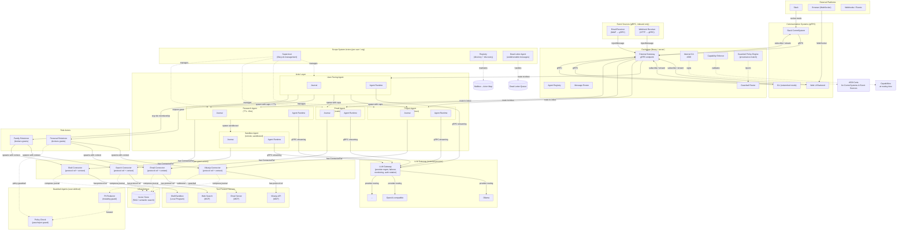

# System Diagram

```mermaid
flowchart TB
    subgraph External["External Platforms"]
        Slack
        Browser["Browser (WebSocket)"]
        Webhooks["Webhooks / Events"]
    end

    subgraph CommSys["Communication Systems (gRPC)"]
        SlackAdapter["Slack CommSystem"]
        WebUI["Web UI Backend"]
        CLI["CLI (networked mode)"]
    end

    subgraph Events["Event Sources (gRPC, inbound only)"]
        EmailReceiver["Email Receiver\n(IMAP → gRPC)"]
        WebhookReceiver["Webhook Receiver\n(HTTP → gRPC)"]
    end

    subgraph LLMGateway["LLM Gateway (external process)"]
        LLMGW["LLM Gateway\n(provider mgmt, failover,\nmonitoring, auth rotation)"]
        Provider1["Ollama"]
        Provider2["OpenAI-compatible"]
        ProviderN["..."]
    end

    subgraph Exchange["Exchange (library / server)"]
        direction TB
        Gateway["External Gateway\ngRPC endpoint"]
        AgentRegistry["Agent Registry"]
        Router["Message Router"]
        CA["Internal CA\nx509"]
        CapEnforce["Capability Enforcer"]
        GuardRoute["Guardrail Router"]
        GuardPolicy["Guardrail Policy Engine\n(provenance match)"]
    end

    subgraph ScopeInfra["Scope System Actors (per user / org)"]
        Super["Supervisor\n(lifecycle management)"]
        Reg["Registry\n(directory + discovery)"]
        DL["Dead Letter Agent\n(undeliverable messages)"]
    end

    subgraph Infrastructure["Infrastructure"]
        RAG[("Vector Store\n(RAG / semantic search)")]
    end

    subgraph Actors["Actor Layer"]
        direction TB
        subgraph AgentFrontend["User-Facing Agent"]
            Journal1["Journal"]
            AR1["Agent Runtime"]
        end
        subgraph AgentVikunja["Project Agent\n(Vikunja context)"]
            Journal2["Journal"]
            AR2["Agent Runtime"]
        end
        subgraph AgentEmail["Email Agent\n(routing rules)"]
            Journal3["Journal"]
            AR3["Agent Runtime"]
        end
        subgraph AgentResearch["Research Agent\n(TTL: 15m)"]
            Journal4["Journal"]
            AR4["Agent Runtime"]
        end
        subgraph AgentChild["Sandbox Agent\n(remote, sandboxed)"]
            Journal5["Journal"]
            AR5["Agent Runtime"]
        end
    end

    subgraph Roles["Role Actors"]
        PersonalRole["Personal RoleActor\n(brokers grants)"]
        OrgsRole["Family RoleActor\n(brokers grants)"]
    end

    subgraph Connectors["Connectors (per-grant actors)"]
        CV["Vikunja Connector\n(protocol ref + context)"]
        CE["Email Connector\n(protocol ref + context)"]
        CSearch["Search Connector\n(protocol ref + context)"]
        CShell["Shell Connector\n(protocol ref + context)"]
    end

    subgraph Guardrails["Guardrail Agents (user-defined)"]
        GR1["PII Redactor\n(mutating guard)"]
        GR2["Policy Check\n(pass/reject guard)"]
    end

    subgraph ProtocolServers["Tool Protocol Servers"]
        P1["Vikunja API\n(MCP)"]
        P2["Email Server\n(MCP)"]
        P3["Web Search\n(MCP)"]
        P4["Shell/Sandbox\n(Local Program)"]
    end

    Slack -->|socket mode| SlackAdapter
    Browser -->|WebSocket| WebUI

    SlackAdapter -->|gRPC| Gateway
    WebUI -->|gRPC| Gateway
    CLI -->|gRPC| Gateway

    EmailReceiver -->|InjectMessage| Gateway
    WebhookReceiver -->|InjectMessage| Gateway

    Gateway -->|route to inbox| AgentFrontend
    Gateway -->|route to inbox| AgentVikunja
    Gateway -->|route to inbox| AgentEmail
    Gateway -->|route to inbox| AgentResearch

    Gateway <-->|subscribe / stream| SlackAdapter
    Gateway <-->|subscribe / stream| WebUI
    Gateway <-->|subscribe / stream| CLI

    AgentFrontend -->|spawn with caps| AgentVikunja
    AgentFrontend -->|spawn with caps| AgentEmail
    AgentFrontend -->|spawn with caps + TTL| AgentResearch
    AgentResearch -->|spawn sandboxed| AgentChild

    AgentFrontend -->|request grant| PersonalRole
    AgentFrontend -->|org role membership| OrgsRole
    PersonalRole -->|spawns with context| CV
    PersonalRole -->|spawns with context| CE
    OrgsRole -->|spawns with context| CSearch
    OrgsRole -->|spawns with context| CShell

    AgentVikunja -->|has ConnectorRef| CV
    AgentEmail -->|has ConnectorRef| CE
    AgentResearch -->|has ConnectorRef| CSearch
    AgentChild -->|has ConnectorRef| CShell

    CV -->|has protocol ref| P1
    CE -->|has protocol ref| P2
    CSearch -->|has protocol ref| P3
    CShell -->|has protocol ref| P4

    CV -.->|compress journal| RAG
    CE -.->|compress journal| RAG
    CSearch -.->|compress journal| RAG
    CShell -.->|compress journal| RAG

    AR1 -->|gRPC streaming| LLMGW
    AR2 -->|gRPC streaming| LLMGW
    AR3 -->|gRPC streaming| LLMGW
    AR4 -->|gRPC streaming| LLMGW
    AR5 -->|gRPC streaming| LLMGW

    LLMGW -->|provider routing| Provider1
    LLMGW -->|provider routing| Provider2
    LLMGW -->|provider routing| ProviderN

    CV -.->|outbound → guardrail| GR1
    GR1 -.->|forward| GR2

    PersonalRole -.->|policy guardrail| GR2

    GuardPolicy -.->|injects| GuardRoute

    Super -.->|manages| AgentFrontend
    Super -.->|manages| AgentVikunja
    Super -.->|manages| AgentEmail
    Super -.->|manages| AgentResearch
    Reg -.->|maintains| AgentMap[("Mailbox→Actor Map")]
    CA -.->|signs| Certs["x509 Certs\nfor CommSystems & Event Sources"]
    CapEnforce -.->|validates| Caps["Capabilities\nat routing time"]
    DL -.->|handles| DeadQ[("Dead Letter Queue")]
```
