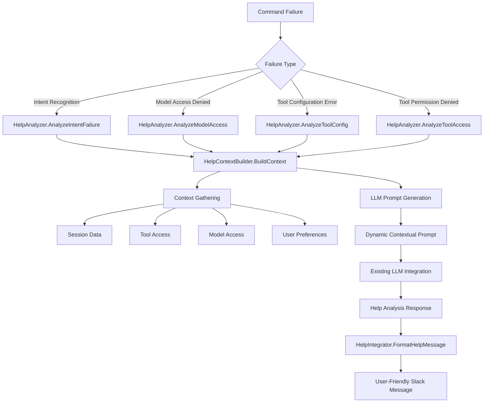

# LLM-Based Intelligent Help System

This document outlines the refined design for an LLM-powered intelligent help system that provides dynamic assistance
to users when they fail to execute commands in Marvin Slacker.

## Core Innovation: Dynamic LLM Analysis

Instead of static JSON files and rule-based systems, this approach leverages Marvin's existing LLM infrastructure to:

1. **Analyze Context in Real-Time**: Understand user intent, recent activity, and available resources
2. **Generate Personalized Suggestions**: Tailor help to the specific failure scenario and user context
3. **Adapt and Learn**: Improve help quality through LLM reasoning without manual updates
4. **Maintain Simplicity**: Eliminate complex rule systems and JSON maintenance

## Architecture Overview



## Key Components

### 1. HelpAnalyzer - LLM-Powered Analysis

The core component that leverages Marvin's LLM to analyze failures:

```go
type HelpAnalyzer struct {
    llm            query.LLM        // Existing Ollama integration
    config         *config.File
    sessionManager *SessionManager
}

// Each failure type gets specialized LLM analysis
func (h *HelpAnalyzer) AnalyzeIntentFailure(ctx context.Context, message string, helpCtx *HelpContext) (*HelpAnalysis, error)
func (h *HelpAnalyzer) AnalyzeModelAccess(ctx context.Context, model, reason string, helpCtx *HelpContext) (*HelpAnalysis, error)
func (h *HelpAnalyzer) AnalyzeToolConfig(ctx context.Context, toolType, configStr string, err error, helpCtx *HelpContext) (*HelpAnalysis, error)
func (h *HelpAnalyzer) AnalyzeToolAccess(ctx context.Context, toolName, reason string, helpCtx *HelpContext) (*HelpAnalysis, error)
```

### 2. Dynamic Prompt Generation

Instead of static templates, prompts are dynamically generated with rich context:

```go
func (h *HelpAnalyzer) buildIntentFailurePrompt(message string, helpCtx *HelpContext) string {
    return fmt.Sprintf(`You are an intelligent help assistant for Marvin.

USER QUERY: "%s"

CONTEXT:
- Available Tools: %s
- Recent Commands: %s
- User is Admin: %t
- User Preferences: %+v

TASK: Analyze the failed command and provide intelligent help.

RESPONSE FORMAT (JSON):
{
  "diagnosis": "Brief explanation of what went wrong",
  "suggestions": ["exact command suggestions"],
  "examples": ["usage examples with context"],
  "context_help": "Additional guidance",
  "confidence": 0.85
}`,
        message, availableTools, recentCommands, helpCtx.IsAdmin, helpCtx.SessionPrefs)
}
```

### 3. Rich Context Gathering

The system gathers comprehensive context for LLM analysis:

```go
type HelpContext struct {
    UserID           string
    ChannelID        string
    OriginalMessage  string
    AvailableTools   []string    // Tools user can access
    AvailableModels  []string    // Models available to user
    IsAdmin          bool        // Admin status affects options
    RecentCommands   []string    // Last 5 commands for context
    SessionPrefs     *UserPreferences
}
```

## Failure Scenario Integration

### 1. Intent Recognition Failures

**Location**: `intent_matcher.go:300`
**Current**: Silent fallback to LLM query
**Enhanced**: Intelligent analysis and suggestions

```go
// Current
return bestMatch, nil

// Enhanced
if bestMatch == nil {
    analysis, err := helpIntegrator.HandleIntentFailure(ctx, userID, channelID, message)
    if err == nil && ShouldShowHelp(analysis) {
        return &HelpIntent{analysis: analysis}, nil
    }
}
return bestMatch, nil
```

### 2. Model Access Denials

**Location**: `query_streaming.go:91-98`
**Current**: Silent fallback with security log
**Enhanced**: Transparent communication with alternatives

```go
// Current
if !allowed {
    qs.securityLogger.LogError(...)
    model = config.DefaultLanguageModel
}

// Enhanced
if !allowed {
    analysis, err := helpIntegrator.HandleModelAccessFailure(ctx, userID, channelID, model, reason)
    if err == nil {
        updater.AddHelpMessage(helpIntegrator.FormatHelpMessage(analysis))
    }
    model = config.DefaultLanguageModel
}
```

### 3. Tool Configuration Errors

**Location**: `intent_handlers.go:ParseToolConfig()`
**Current**: Basic error messages
**Enhanced**: Interactive help with examples

```go
// Current
return nil, fmt.Errorf("unsupported tool type: %s", toolType)

// Enhanced
analysis, err := helpIntegrator.HandleToolConfigError(ctx, userID, channelID, toolType, configStr, err)
if err == nil {
    return &ConfigErrorWithHelp{config: config, help: analysis}, nil
}
return nil, err
```

### 4. Tool Permission Denials

**Location**: `multitenant.go:canUserAccessTool()`
**Current**: Silent filtering
**Enhanced**: Transparent access reporting

```go
// Current
if tts.canUserAccessTool(userCtx.UserID, name) {
    // Add to tool set
}

// Enhanced
inaccessibleTools := []string{}
for _, tool := range availableTools {
    if !tts.canUserAccessTool(userCtx.UserID, tool) {
        inaccessibleTools = append(inaccessibleTools, tool)
    }
}
if len(inaccessibleTools) > 0 {
    analysis, err := helpIntegrator.HandleToolAccessDenied(ctx, userID, channelID, tool, "Permission denied")
    // Send help message about unavailable tools
}
```

## Example Help Interactions

### Intent Recognition Failure
```
User: "add http tol at https://api.example.com/mcp"

🤖 **Intelligent Help**

**Issue:** Command not recognized. Did you mean "add http tool"?

**Suggestions:**
1. Check command syntax - you may have a typo
2. Use the correct tool command format

**Examples:**
• `add http tool at https://api.example.com/mcp`
• `add local program /usr/bin/git`
• `add docker tool nginx:latest`

**Additional Help:**
I detected you were trying to add an HTTP tool. The correct command is "add http tool" (not "tol").
```

### Model Access Denied
```
User: "@marvin use llama3.2:70b"

🤖 **Intelligent Help**

**Issue:** Model 'llama3.2:70b' not available to your user level.

**Suggestions:**
1. Use available models for your account
2. Request access from admin if needed

**Examples:**
• `@marvin model list` to see available options
• Continue with current model: ministral-3:3b

**Additional Help:**
Using default model 'ministral-3:3b' instead. Available to you: llama3.2:latest, qwen2.5:7b.
```

### Tool Configuration Error
```
User: "add ftp tool at ftp://example.com"

🤖 **Intelligent Help**

**Issue:** 'ftp' is not a supported tool type.

**Suggestions:**
1. Use HTTP tools for web API integration
2. Use local tools for command-line programs
3. Use Docker tools for containerized environments

**Examples:**
• `add http tool at https://api.example.com/mcp`
• `add local program /usr/bin/git`
• `add docker tool postgres:15`

**Additional Help:**
Supported tool types are: http, local, docker. FTP can be accessed via HTTP tools with proper endpoints.
```

## Configuration Integration

### HCL Configuration for Help System

```hcl
help_system {
    enabled = true
    confidence_threshold = 0.6      # Show help above this confidence
    llm_temperature = 0.3           # Lower temperature for consistent analysis
    max_response_time = "5s"         # Timeout for help analysis
    fallback_enabled = true           # Use static help if LLM unavailable
    cache_responses = true           # Cache similar help responses
}

display {
    help_emoji = "🤖"
    detailed_help = true             # Show examples and context
    quick_suggestions = true         # One-line suggestions for simple cases
    interactive_options = true       # Provide action buttons where appropriate
}
```

## Implementation Benefits

### **Over Static JSON Approach**
1. **No Maintenance Overhead**: Help evolves automatically with system changes
2. **Contextual Intelligence**: LLM understands nuanced situations
3. **Adaptive Responses**: Handles edge cases and new tool types gracefully
4. **Reduced Complexity**: No complex rule systems to maintain

### **Leverages Existing Marvin Infrastructure**
- **Same LLM**: Uses existing Ollama integration
- **Session Management**: Reuses user session and preference systems
- **Tool Integration**: Leverages existing tool access control
- **Multi-tenant Support**: Works seamlessly with admin/user model

### **User Experience Improvements**
- **Personalized Help**: Tailored to user role, preferences, and history
- **Intelligent Corrections**: Understands intent beyond surface-level matching
- **Educational Value**: Teaches correct usage patterns
- **Progressive Disclosure**: Starts simple, offers detailed help when needed

## File Structure

```
internal/slacker/
├── help_analyzer.go           # LLM-based help analysis
├── help_context.go            # Context gathering and integration
├── help_integrator.go         # Main help integration orchestration
├── help_metrics.go           # Performance tracking
└── help_prompts.go           # Dynamic prompt generation

Modified Files:
├── intent_matcher.go          # Add help suggestions on low confidence
├── message_handler.go         # Integrate help into message flow
├── query_streaming.go         # Add model access help
├── intent_handlers.go         # Enhanced tool configuration errors
└── tool_manager.go            # Add tool access help reporting
```

This LLM-based approach creates a truly intelligent help system that grows with Marvin's capabilities and provides
users with personalized, contextual assistance exactly when they need it most.
